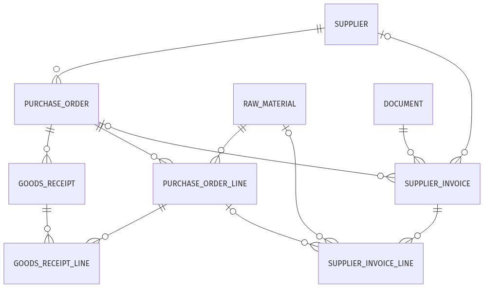

# Data Model

## Scope

v1 of the data model covers the accounts payable side of Brunnstein's operations: incoming supplier invoices validated against purchase orders and goods receipts. The sales side (customers, sales orders, customer invoices) and production (plants, recipes, production runs, quality checks) are deferred to later iterations.

## System landscape

The model represents data from three logical source systems, collapsed into one Aurora DSQL database for the demo:

| System | Owns | v1 status |
|---|---|---|
| ERP | Master and transactional business data: supplier, raw_material, purchase_order, goods_receipt, supplier_invoice | implemented |
| S3 | Source PDFs for incoming supplier invoices; referenced by `supplier_invoice.source_s3_key` | implemented |

## Data layers

The same domain shows up in three states across DSQL and S3:

| Layer | Where | What it represents |
|---|---|---|
| Operational data | DSQL tables: `supplier`, `purchase_order`, `goods_receipt`, etc. | Master data and validated transactions Brunnstein already trusts. |
| Historical inventory | PDFs in `s3://...invoices/<year>/<supplier>/` | Source PDFs for invoices already in the DB. One row in `supplier_invoice` per file. |
| Inbox | Local `test_invoices/` (later: S3 prefix or email ingest) | Invoices that have not yet been processed. No corresponding row in `supplier_invoice` exists. |

The agent takes an inbox PDF, looks up the operational data, and decides whether to promote the PDF into a `supplier_invoice` row. Test cases live in `data/pdf/supplier_invoice/test_cases.py`, which reads the DB to construct realistic scenarios but never writes back. Re-running it does not dirty state.

## Entities (v1)

| Entity | Purpose |
|---|---|
| `supplier` | Master data for parties Brunnstein buys from. Address inlined for v1. |
| `raw_material` | Inputs purchased from suppliers (packaging, ingredients, auxiliaries). |
| `purchase_order` | Header for a purchase commitment to a supplier. |
| `purchase_order_line` | Line items on a purchase order. |
| `goods_receipt` | Records that ordered materials physically arrived. |
| `goods_receipt_line` | Quantities received per PO line. |
| `supplier_invoice` | Incoming invoice from a supplier. Extraction fields nullable until the agent fills them in. Carries `source_s3_key` pointing at the original PDF. |
| `supplier_invoice_line` | Line items on a supplier invoice. |

## ERD

Regenerate from the models with `uv run python -m data.generate_erd --png docs/erd.png`.

## Three-way match

The validation agent enforces a three-way match across three independent records:

1. `purchase_order` declares what Brunnstein intends to buy and at what price.
2. `goods_receipt` confirms what physically arrived at a plant.
3. `supplier_invoice` claims what the supplier wants to be paid.

For each PO line, the agent checks that quantity and unit price agree across the three sources within a tolerance. Discrepancies route to human review.

## IBAN fraud check

`supplier.iban` stores the bank account on file in supplier master data. `supplier_invoice.payment_iban` stores what is printed on the incoming PDF. The two are compared explicitly: an unexpected IBAN is one of the most common indicators of invoice fraud (a redirect attack on a real supplier relationship).

## Money and precision

- Totals use `Numeric(12, 2)`: two decimal places in euros.
- Unit prices use `Numeric(10, 4)`: four decimals so per-bottle prices like 0.0345 EUR survive without rounding before quantities are applied.
- Quantities use `Numeric(12, 3)`: supports fractional units of measure (kg, litres).

## Enums

Aurora DSQL does not support custom enum types. Enums are materialised as `VARCHAR` columns with `CHECK` constraints (see `_enum()` in [data/models.py](../data/models.py)). The Python `StrEnum` definitions stay the source of truth.

## Foreign keys

SQLAlchemy `ForeignKey` declarations are present on every relationship for ORM use. DSQL does not enforce foreign key constraints at the database level, so the generated DDL will strip them in iteration 5. Referential integrity is enforced in application code.

## Out of scope for v1

| Entity | Reason |
|---|---|
| `customer`, `sales_order`, `customer_invoice`, `payment_received` | Sales side, not touched by use case 1 (AP). |
| `delivery_note` (`Lieferschein`) | Outbound logistics, sales side. |
| `plant`, `production_line`, `recipe`, `production_run`, `quality_check` | Production / MES. Reserved for the IoT use case. |
| `contract` | Reserved for a future RAG use case over signed supplier and customer agreements. |
| `payment` (outgoing) | Downstream of invoice approval; not part of intake validation. |
| `warehouse`, `stock_level`, `stock_movement` | Inventory management. Not required for AP validation. |
| `price_list`, `promotion` | Catalog complexity; not relevant for AP. |
